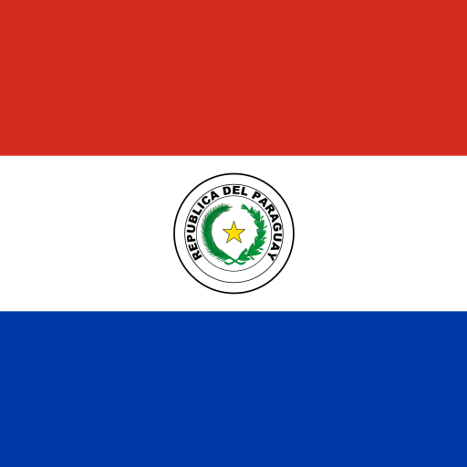

### Hi there 👋!

My name is Saul, Software Engineer and Professor from , *Paraguay*.

Experienced in creating high-quality code considering the best coding practices, architectural patterns, and performance. Experienced in leading small development teams using agile methodologies.

Interested in devising a better problem-solving method for challenging tasks, and learning new technologies and tools if the need arises.

🔭 I’m currently working on eBook on Data Structures and Algorithms!
